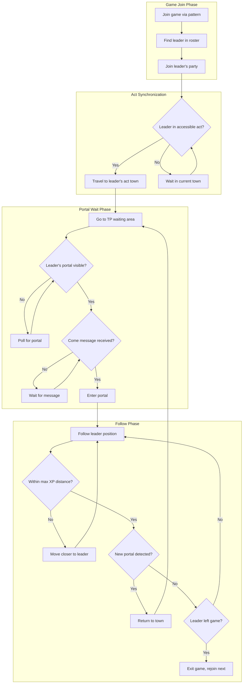

# Leader-Leecher Run Implementation

## Overview

Create a new run type where bots follow a leader (human or bot) through portals, maintaining distance for XP sharing. The leecher waits at TP areas for portals, enters on a "come" chat message (or message bus signal for bot leaders), and follows the leader at max XP distance.

## Architecture




## Components to Implement

### 1. Chat Message Reading (d2go)

Add memory reading for in-game chat messages to detect the "come" signal.**Files:**

- `d2go-personal/pkg/memory/chat.go` (new) - Chat message memory reading
- `d2go-personal/pkg/memory/offset.go` - Add chat offset
- `d2go-personal/pkg/memory/game_reader.go` - Add GetChatMessages()
- `d2go-personal/pkg/data/data.go` - Add ChatMessages field

### 2. New Run Configuration

Add config options for the leader-leecher run.**File:** [`internal/config/config.go`](internal/config/config.go)

```go
LeaderLeecher struct {
    LeaderName       string   // Character name to follow
    GameNamePattern  string   // Game pattern (e.g., "run-")
    GamePassword     string
    ComeMessage      string   // Chat trigger (e.g., "come", "go", "tp")
    MaxLeaderDistance int     // Max distance from leader for XP (default ~40)
    JoinDelayMin     int
    JoinDelayMax     int
    UseLegacyGraphics bool
} `yaml:"leaderLeecher"`
```


### 3. New Run Type

Create the leader-leecher run.**Files:**

- [`internal/config/runs.go`](internal/config/runs.go) - Add `LeaderLeecherRun` constant
- `internal/run/leader_leecher.go` (new) - Main run logic
- [`internal/run/run.go`](internal/run/run.go) - Register in BuildRun

### 4. Leecher Supervisor Mode

Similar to follower mode, handle leecher behavior in supervisor.**File:** [`internal/bot/single_supervisor.go`](internal/bot/single_supervisor.go)

- Add `runLeecherMode()` function
- Add leecher registry similar to follower registry

### 5. Following Logic

Implement leader position tracking and distance maintenance.**File:** `internal/action/follow.go` (new)

```go
func FollowPlayer(playerName string, maxDistance int) error
func GetPlayerPosition(playerName string) (data.Position, area.ID, bool)
func IsWithinDistance(playerName string, maxDist int) bool
```

Uses existing `data.Roster.FindByName()` which provides player position and area.

### 6. Portal Detection and Entry

Leverage existing portal logic from [`internal/action/tp_actions.go`](internal/action/tp_actions.go):

- `UsePortalFrom(owner string)` - Already exists
- `TPWaitingArea()` - Already defined per act in `internal/town/`

### 7. Message Bus Extensions

Add "come" message type for bot-to-bot signaling.**File:** [`internal/bot/messagebus/messages.go`](internal/bot/messagebus/messages.go)

```go
type LeecherComeMessage struct {
    BaseMessage
    LeaderName string
}
```


### 8. UI Template

Add configuration panel for the run.**File:** [`internal/server/templates/run_settings_components.gohtml`](internal/server/templates/run_settings_components.gohtml)

### 9. HTTP Server Form Handling

**File:** [`internal/server/http_server.go`](internal/server/http_server.go)

## Key Implementation Details

### XP Distance

D2R experience sharing range is approximately 2 screens (~40-50 game units). Default `MaxLeaderDistance` to 35 for safety margin.

### Act Accessibility Check

Check if leecher has waypoints or can walk to leader's act. If not, wait in current town and poll leader's area from roster.

### Chat Message Detection

Will need to find the memory pattern for chat messages in D2R. This is the most uncertain part - may require research/testing.

## Execution Order

1. Implement chat reading in d2go (if pattern can be found)
2. Add config and run constant
3. Implement follow action utilities
4. Create leader_leecher.go run
5. Add leecher mode to supervisor
6. Add message bus message type
7. Add UI template and form handling